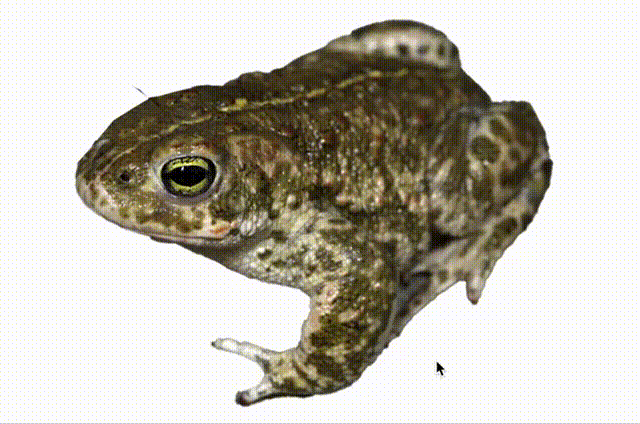
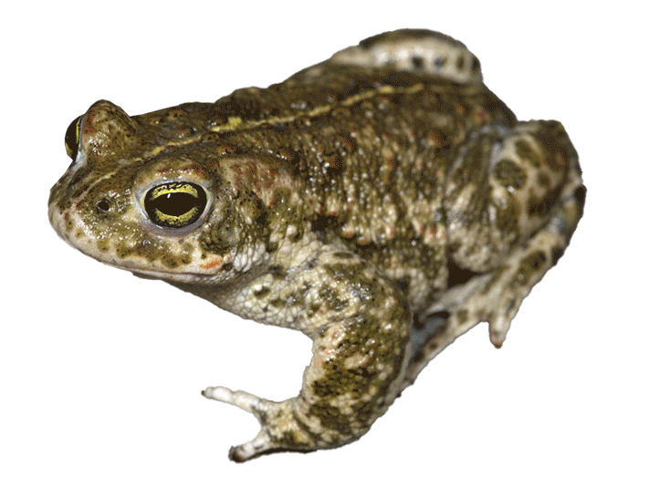
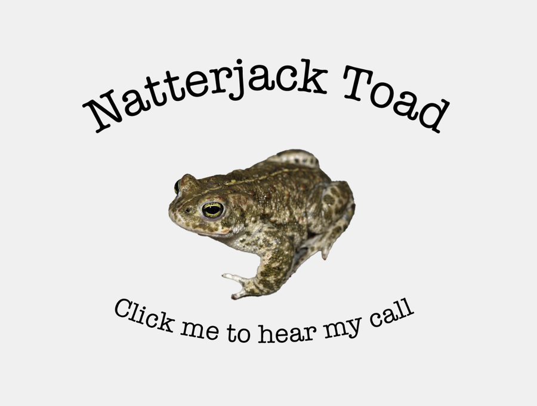
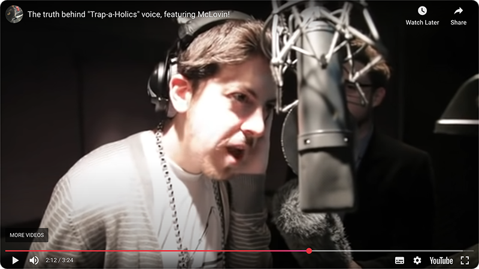

My girlfriend is changing her career and is interested in going into ecology. To do so, she's embarked on an ecology training course to bring her up to speed in the industry. She's always been interested in nature, animals and especially ponds/pond life. So, when the course required her to create a fact sheet on an endangered animal, she picked the natterjack toad.

I don't know much about toads. The neighbour next door when I was growing up had a pond with frogs and/or toads. My dad was terrified of them. But, when Lucy started making her fact sheet, she asked, "Could we make a QR code so that people could scan it and hear the sound of a natterjack toad?"

The natterjack toad is famous for its loud mating call. So, how do we create a website, featuring a natterjack toad's call, to load up with a QR code?
- Encode a QR code for a YouTube video of a natterjack toad? *Boring.*
- Create a website with embedded natterjack toad video? *Better, but still boring.*
- Make a simple website and use HTML5 audio player to play the sound in the background? *Better, but the user needs to click to start sound and there's still some fun to be had.*
- Make a simple animation of a natterjack toad, animate it with javascript, trigger audio via a click on the frog and create a meme page for fun? *That's more like it!*

So, I spent a few hours, then a few more hours the next day creating this site...

## Creating the animation

Creating the animation was easy with Photoshop. After a bit of trial and error I decided that it should just blink. First I cut out the eyes and moved to new layers. Then, created a fill using the Content Aware Fill tool to fill in some 'skin' behind the eye holes. Moved and manipulated the eyes to create frames where the toad was blinking with one eye, then both. I tested the blink by toggling Photoshop layers and decided this was good enough.

After editing the other eye's blink and putting them all together into a timeline, we have:

And voilà! He's quite cute, isn't he?

## Creating the website

The animation was easy - put all the images into one div and style their position absolutely, so they all sit on top of each other. Use javascript to show one at a time, in order. Javascript gives us the advantage of being able to add random numbers to the blink speed, so the toad blinks at different intervals. Also, we can trigger the blink, so the toad blinks when the user clicks to play the sound.

### Setting up the sound

Sound wasn't too bad either. We started with a hidden player, play triggered by javascript. The toad's call was quite long though, so adding a volume slider and stop button felt needed. I wrapped these into a div and had them reveal upon first click of the toad.

Later, I decided I wanted multiple different sounds to play, so some further work was done to trigger a random sound on click, not play the same sound twice, provide a fallback sound, and further supporting steps.

### Responsive styling 

Yes, I did a bit of responsive styling so it would show up as expected on mobile. I'm not 100% happy with it, but it does the job. This was only meant to be a quick project!

### Custom volume slider

I thought it would be funny to create a custom volume slider using a toad as the 'knob'. This works pretty well but was a lot of work to get working across browsers and devices. I wouldn't bother in future, the default one works the best and looks alright most of the time.

### Illustrator titles

This worked nicely. I created an Illustator document and created a number of different titles, subtitles and text in their own artboards. I exported the artboards into my project and left them with their exported names. I used the images for text on the site. This spared me from dealing with Adobe fonts and made it easy to update graphics quick, by editing in Illustrator and exporting.

### Quirks

Some weird quirks I haven't had time to fix. Click pause doesn't always work first time - believe this might be due to the way HTML5 audio 'promises' to stop playing the audio, causing a delay or for the stop button to try stopping the audio before it's started. Still, it normally works and pressing twice will stop the audio eventually.

The volume slider works, but does have some issues on mobile. I think the stop button is more important between the two. Maybe I will fix this if I find some more time.

## The site

The site's more or less finished and live. <a href="https://natterjack.netlify.app/" target="_blank">You can take a look here</a>.

## The memey bit

I was sitting there, happy with the site. It was loaded up on Netlify and I was just tapping the toad over and over again watching it blink on cue. But I could hear the toad's voice in my head. It was saying, "REAL TRAP SHIT"

<a href="https://youtu.be/u0Ckea66ns8?t=126" target="_blank">Watch the video</a>

This is where multiple audio clips came in useful. I downloaded the audio and cut it up into clips. I created a new page called `trap.html` where I uploaded the clips. I was right, the voice fit the toad perfectly.

Give it a try! Visit <a href="https://natterjack.netlify.app/trap.html" target="_blank">natterjack.netlify.app/trap.html</a>.