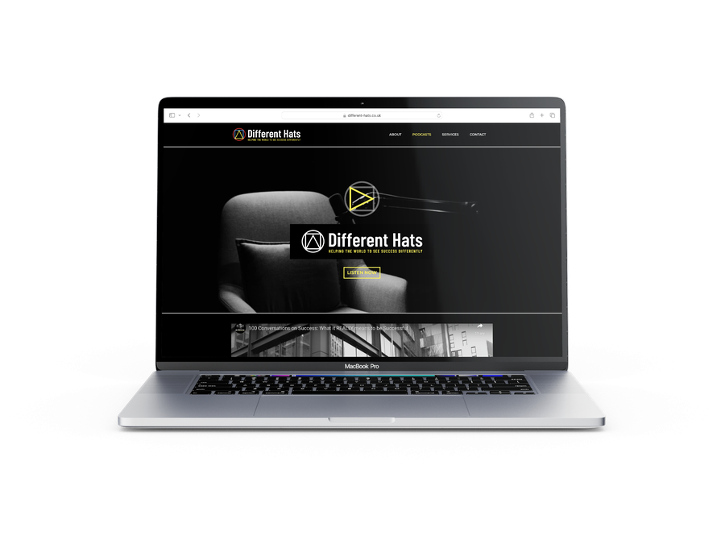
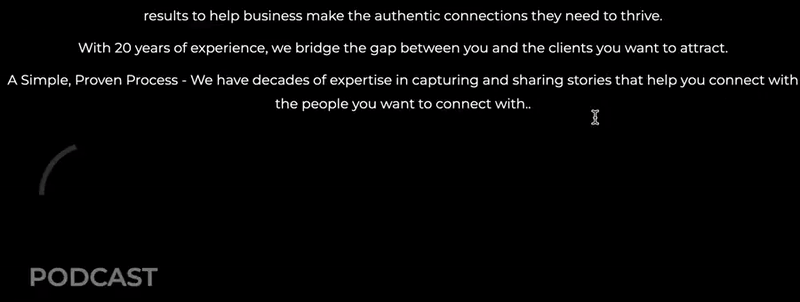

Sam's been a pleasure to work with since we were introduced and his projects have inspired me. We rushed to complete the site in time for his 100th podcast special. For which I was invited along with over 100 other connections to a first viewing and drinks evening. Sam is making an effort to redefine how we see success. He looks at mental health in today's hustle culture and considers different ways of thinking to improve this. On Sam's podcast he features various different guests with their own stories and views on success, mental health and more. Sam also runs a variety of networking events in Brighton, including County Business Clubs or CBC 100, Brighton Business Show, Firm Balls and more.

<a href="https://thebusinessgroup.co.uk/" target="_blank">Visit thebusinessgroup.co.uk to find out more about Sam's other enterprises.</a>

## The brand

I worked with Bill Wallsgrove of Brandad who specialises in brand consultation, having had an interesting and successful career in the industry. Bill came up with the general idea for the brand - a bauhaus style and asked me to have a play with it. The inspiration behind this was Sam's different hats, and how the bauhaus shapes could be used or combined to create different hats.

I liked the idea of these shapes and saw the possibility of animating them using javascript so that they could be drawn onto the page. I created a logo and after a few tweaks and changes I created a landing page for the brand/website.

## The website

I used Webflow to create the website. It's a fantastic website builder allowing me to use my knowledge of CSS and HTML for effective design and mobile responiveness, while handling the server side behind the scenes. Webflow costs a fair amount per month compared to a cheap Wordpress setup. However, it saves time creating and editing the site in future. Also there's no server setup and I'm yet to experience any noticeable downtime.

Once the site is complete, creative control can easily be handed over to the client. Either by providing full editing access or simple editor access to tweak text.

I found a suitible template to start with and changed it to suit the brand. Sam had a great set of photos to use for the site which made things look professional with ease.

### Different pages

With an idea of the design based off the homepage I started to create supporting pages. Using Sam's fantastic images as header photos and other elements from the homepage, including the animations I will talk about later, it was easy to create further templates for other pages. Webflows CSS based design settings make working with design accross multiple pages fast, as I could update the design on one page, and as long my classes were correct, the design would update on matching pages.

## Animations

When I fist started creating this animation setup I thought it was overkill. The animations were based around the Vivus library, which is really useful for animating paths. I wanted to be able to create any shape I wanted using paths in Illustrator and have them drawn out one by one. So I created `vivus-illustratorSVGpaths`...

### vivus-illustratorSVGpaths

Vivus is great for animating SVGs. However, can cause some issues when working with SVGs from Adobe Illustrator. I've made it work before with a lot of wrangling, so wanted to create something that was more reliable.

Through trial and error I created a repo which allowed me to drag SVGs into the correct folder, run a python script to process them and prevent issues and load onto a website with ease. I also included a javascript observer which made the animations play as the user scrolls them into view. Plus some further logic on this making multiple animations play one after another if scrolled into view at the same time. This worked great.

I thought it was overkill since we only wanted to use three shapes to start with. If we had stuck with three shapes then this work would have been too much - I could have just wrangled three different files to work with Vivus. However, at this point there are over 30 SVGs which have all been used at stages. It also means that creating more is very little effort.

I uploaded my repo to Netlify so that I could serve code to the Webflow server and it all worked great.

You can check out my repo on <a href="https://github.com/george-m8/vivus-illustratorSVGpaths" target="_blank">Github</a>.

## In summary

In summary, Webflow is a great choice for building a website and allows all sorts of complicated setups if you know what you're doing.

Vivus animations worked great and I hope to use my repo again in future projects.

Sam was really happy with his site and it received a lot of compliments.