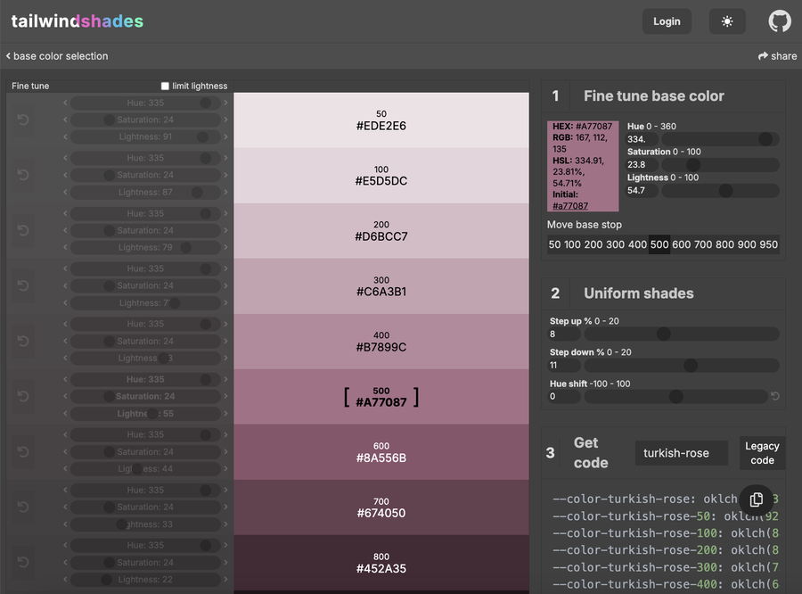
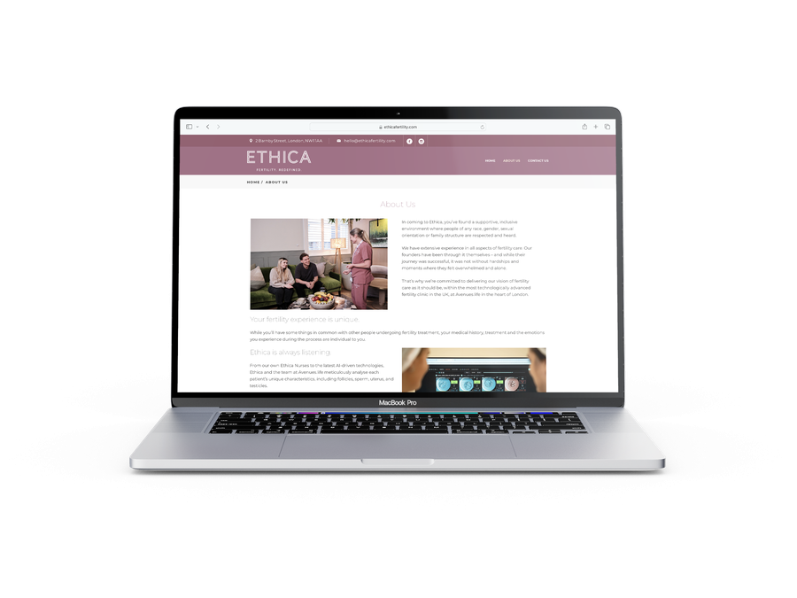

Ethica Fertility is not quite finished, but we've got it to a stage where we can release the site until the team has finished fleshing out the rest of content and pages. The site is built on Wordpress using a simple template to get started as the team needed a fast turn around.

I was fortunate to work with <a href="https://www.jadebrandagency.com/" target="_blank">Jade Brand Agency</a> who created a simple but effective brand guideline for the company, and gave me a steer on the website design. Ethica had a photographer attend to take high quality photos which were used on the website after some editing from Zero To Sixty.

*An example of an edited image for Ethica Fertility's website - transparency added to make the image fit nicely with the page's design.*

## Colours

While the provided brand guideline was relatively simple, this gave me plenty of space to work on the website. With only the main pink colour and some accented pastel tones to work with, I needed some more gradients of that pink to make visual separation between different elements.

### Introducing Tailwind Shades

<a href="https://www.tailwindshades.com/" target="_blank">Tailwind shades (or tailwindshades.com)</a> is a useful tool created for <a href="https://tailwindcss.com/" target="_blank">tailwind CSS</a>, so is not entirely appropriate for use with a Wordpress site. What it does well though, is taking an individual input colour and providing a gradient of swatches to use based off of certain parameters. While it's great for use with tailwind CSS, it's also a useful tool for generating gradients.

Since this theme wanted around six different colours for the quick navigation bar, tailwind shades worked great. I put in my colour, set where that colour should fall in the gradient and set up the steps between colours and I had a lovely range of swatches to use.

## WP Bakery

I normally like to use Elementor with Wordpress as it's easy for the client to edit in future. However, it comes with some issues:
- Elementor messes up some CSS rules or struggles to style its own text
- Elementor creates messy CSS and HTML page structure
- Elementor sometimes doesn't behave logically, showing different previews to the actual page.

I hadn't used much WP Bakery before. It's certainly a little more clunky than Elementor. However, once you get your head around it, it creates much better layouts and resolves many of my issues with Elementor. Design takes longer, but the results are more robust.

I think the client will be fine to edit simple text on the site. However, they normally contact me if doing anything more advanced. I did make them fully aware of the pros and cons before choosing to go this route.

## A nice calendar

While not yet live to the public, the team requested an events calendar on the site. Since the site didn't have events already built in, I started taking a look for suitable events plugins.

### The Events Calendar

I decided to use "The Events Calendar" Wordpress plugin which has worked great. It has a nice layout and is easily customisable with CSS. This post type worked perfectly with the theme's built in post widgets, so we can go straight ahead and show these on the home page or other areas of the site. Users can view events as a list or calendar. Events are automatically sorted and past events are categorised as such. Users can also search for specific events.

## In summary

In summary we've created a great looking simple site for Ethica Fertility with the help of Jade's creative guidance. WP Bakery and The Events Calendar have worked well to provide the design and functionality Ethica needed. The site isn't finished and I look forward to finishing it off.